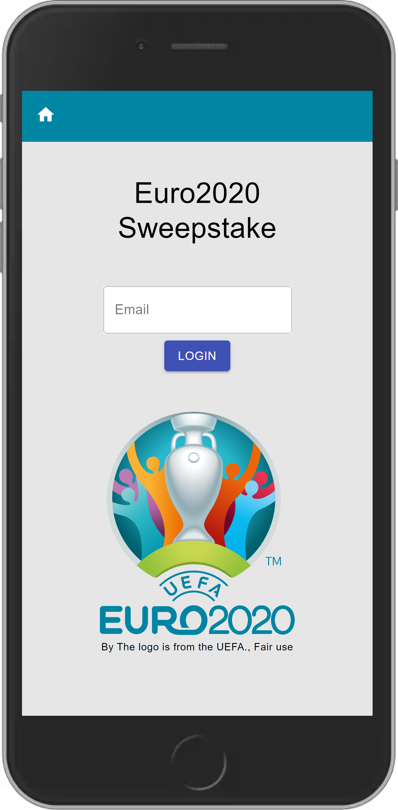
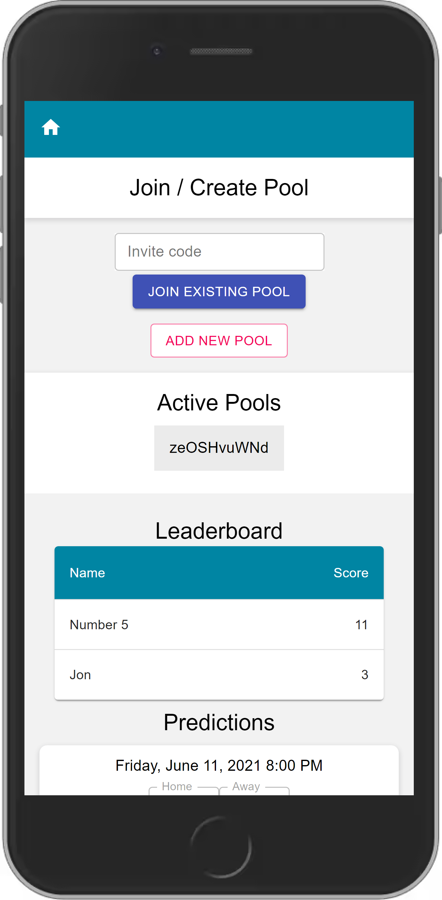

# Euro 2020 Sweepstake Project

> Codeworks Solo Project

## Table of contents

- [Goal](#goal)
- [Screenshots](#screenshots)
- [Technologies](#technologies)
- [Setup](#setup)
- [Features](#features)
- [Status](#status)
- [Contact](#contact)

## Goal

Build a portal to manage sweepstakes for the Euro 2020 tournament, utimately to replace manually managed sweepstakes that are on paper or in spreadsheets.

## Screenshots

## Tech Stack

- Express
- Sequelize (using Postgres)
- React

## Setup

Sign up for an account on https://www.api-football.com/ and create a dotenv file using the example.\
Backend: `npm install && docker-compose up -d && npm run dev`\
Frontend: `cd frontend && yarn && yarn start`

Live version to be provided in the future...

## Features

List of features ready:

- Basic login (email address only, no auth)
- Create new or join existing sweepstake pools using unique
- Make predictions per pool on the group stages of the tournament
- Predictions cannot be updated once each match kickoff has passed
- Leaderboard to keep track of current pool standings

Future suggested improvements:

- Login using an auth provider such as Auth0
- Add names to pools in to make them more identifiable by users
- Add knockout stages to the pool predictions
- Customisable point scoring by owner of each pool
- Improved cross device UI

## Status

Project is: _Work in Progress_

## Contact

Created by [@jonbrook](https://github.com/jonbrook) - feel free to contact me!
